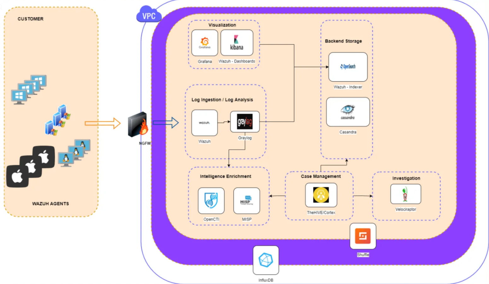
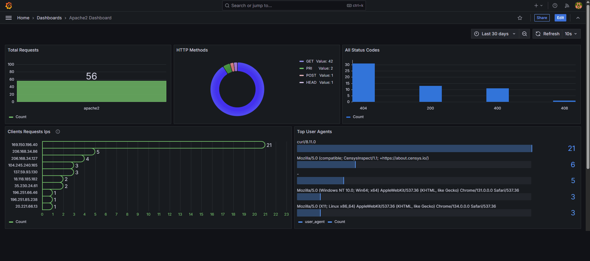
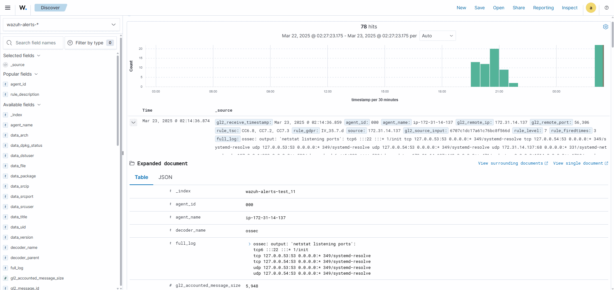
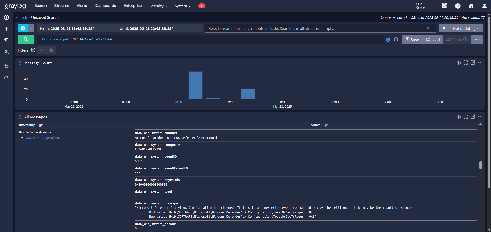
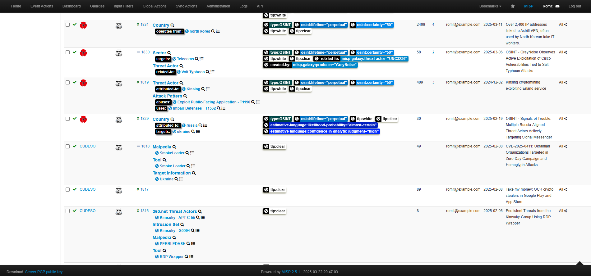

# Open Source SIEM Stack

## Overview

This repository provides a fully open-source SIEM solution for security monitoring, incident detection, and threat intelligence. It integrates Wazuh, Graylog, Grafana, and MISP to offer a complete security operations solution.

## 📖 **[Refer to Deployment Guide](documentation/deployment-guide.md)** for `step-by-step installation` and `setup instructions`

## 📎 **[Refer to Configs](configs/)** for `configuration files`, `grafana dashboard files` And `related setup guides`  

## Features

- **Log Ingestion & Analysis**: Wazuh & Graylog  
- **Threat Intelligence**: MISP  
- **Visualization & Dashboards**: Grafana  
- **Incident Response & Case Management**: The Hive & Cortex  
- **Automation**: Shuffle  

## 📊 SIEM Dashboards & Visualizations

### 1 Grafana SIEM Overview Dashboard

### 2 Wazuh Security Monitoring Dashboard

### 3 Graylog Log Analysis

### 4 MISP Threat Intelligence

## Components

- **Wazuh** - Log collection, monitoring, and security analysis  
- **Graylog** - Log processing and normalization  
- **Grafana** - Visual dashboards for SIEM monitoring  
- **MISP** - Threat intelligence platform  
- **The Hive & Cortex** - Incident management and response  
- **Velociraptor** - Forensic analysis & endpoint security  
- **Shuffle** - Security automation  

## License

This project is licensed under the [MIT License](LICENSE).
